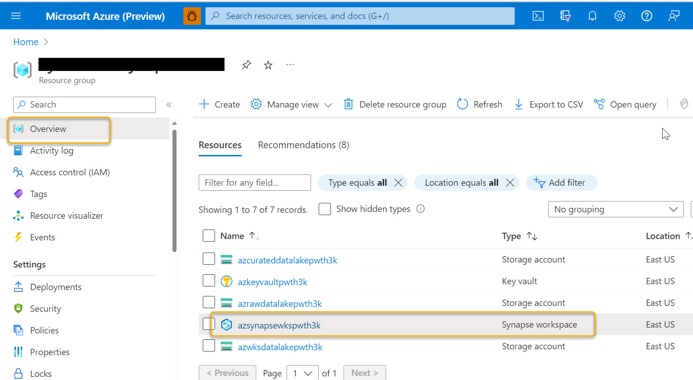

# Data Ingestion and transformation using Spark

Apache Spark in Azure Synapse Analytics is one of Microsoft's implementations of Apache Spark in the cloud. Azure Synapse makes it easy to create and configure a serverless Apache Spark pool in Azure. Spark pools in Azure Synapse are compatible with Azure Storage and Azure Data Lake Generation 2 Storage. In this lab you will use Spark pools to process data stored in Azure.

- Write the output of Spark jobs directly into an ADLS Gen2 location
- Create Spark table reading Azure Open Dataset
- Analyze and visualize data with Apache Spark
 
## Data Source

Azure Open Dataset

 - PublicHolidays
 - NycTlcGreen
 - NoaaIsdWeather

## Prerequisites:
### Log-in to the Azure Portal

1.  In the **Resource groups** blade, navigate to created resource group and select the created  **Synapse Workspace**.

     
   
2. In the  **_Overview_** section of synapseworkspace select **_Open_** to open synapse studio.

  

### Note : Synapse Administrator access is already provided and below two steps are only for the learning and knowledge purpose

1. If you dont have the Synapse Administrator access then synapse workspace will promt **Failed to load** message.


    
2.	To provide Synapse Administrator access In Synapse Studio, under  **_Manage_** tab, select **_Access Control_** and add yourself as the **_Synapse Administrator_**

    
    

   
> **_NOTE:_** Note down the raw storage account name for further references

## Exercise 1 : Access data from Open Dataset and storing in Azure Data Lake Storage Gen2 (ADLS Gen2) with Synapse Spark

**Azure Open Datasets** are curated public datasets that you can use to add scenario-specific features to machine learning solutions for more accurate models. Open Datasets are in the cloud on Microsoft Azure and are integrated into Azure Machine Learning and readily available to Azure Databricks and Machine Learning Studio (classic). You can also access the datasets through APIs and use them in other products, such as Power BI and Azure Data Factory.

**Azure Data Lake Storage Gen2 (ADLS Gen2)** is used as the storage account associated with a Synapse workspace. A synapse workspace can have a default ADLS Gen2 storage account and additional linked storage accounts.
You can access data on ADLS Gen2 with Synapse Spark via the following URL:

``abfss://<container_name>@<storage_account_name>.dfs.core.windows.net/<path>``
 
In Spark, a **Data Frame** is a distributed collection of data organized into named columns. It is conceptually equivalent to a table in a relational database or a data frame in R/Python, but with richer optimizations under the hood. Data Frames can be constructed from a wide array of sources such as: structured data files, tables in Hive, external databases, or existing RDDs.

**Resilient Distributed Datasets (RDD)** is a fundamental data structure of Spark. It is an immutable distributed collection of objects. Each dataset in RDD is divided into logical partitions, which may be computed on different nodes of the cluster. RDDs can contain any type of Python, Java, or Scala objects, including user-defined classes. Formally, an RDD is a read-only, partitioned collection of records. RDDs can be created through deterministic operations on either data on stable storage or other RDDs. RDD is a fault-tolerant collection of elements that can be operated on in parallel.

Following are the overview of steps performed in this exercise:

1.	First, we import Open dataset (PublicHolidays) of 6 months.
2.	Convert imported Open dataset to dataframe
3.	Generate path for raw storage account.
4.	Convert dataframe to parquet file and store in the raw storage account
5.	Convert dataframe to RDD and then save that RDD as a text file in the raw storage account
6.	Last, we will validate the files created in the raw storage account (ADLS Gen2)
7.	Convert parquet file to dataframe and view dataframe.

## Data Flow


The **Spark Notebook** is the open source notebook aimed at enterprise environments, providing Data Scientists and Data Engineers with an interactive web-based editor that can combine Scala code, SQL queries, Markup and JavaScript in a collaborative manner to explore, analyse and learn from massive data sets.

**Steps for creating notebook:**

1.	In Synapse Studio, under **_Develop_** tab, click on the **_+(add new resource)_**  icon, select **_Notebook_**.
 
 
 
2.	Select the Spark Pool in the **_‘Attach To’_** section. 
3.	In the properties section on the right pane , renaming the notebook as **ntb_Open_DataSet_To_ADLS**
4.	Run the below scripts in the command cell. And use **_(+Code)_** icon for new cells.
 
 

### Load sample data

Let's first load the public holidays of last 6 months from Azure Open datasets as a sample. Click on Run button of cell to run the below code.

**_In[1]:_**

```python
from azureml.opendatasets import PublicHolidays

from datetime import datetime
from dateutil import parser
from dateutil.relativedelta import relativedelta

end_date = datetime.today()
start_date = datetime.today() - relativedelta(months=6)
hol = PublicHolidays(start_date=start_date, end_date=end_date)
hol_df = hol.to_spark_dataframe()
```

Displaying 5 rows

**_In[2]:_**

```python
hol_df.show(5, truncate = False)
```
**_Out[2]:_**

``
+---------------+-------------------------+-------------------------+-------------+-----------------+-------------------+
|countryOrRegion|holidayName              |normalizeHolidayName     |isPaidTimeOff|countryRegionCode|date               |
+---------------+-------------------------+-------------------------+-------------+-----------------+-------------------+
|Ukraine        |День незалежності України|День незалежності України|null         |UA               |2020-08-24 00:00:00|
|Norway         |Søndag                   |Søndag                   |null         |NO               |2020-08-30 00:00:00|
|Sweden         |Söndag                   |Söndag                   |null         |SE               |2020-08-30 00:00:00|
|England        |Late Summer Bank Holiday |Late Summer Bank Holiday |null         |null             |2020-08-31 00:00:00|
|Isle of Man    |Late Summer Bank Holiday |Late Summer Bank Holiday |null         |IM               |2020-08-31 00:00:00|
+---------------+-------------------------+-------------------------+-------------+-----------------+-------------------+
only showing top 5 rows
``

### Write data to the default ADLS Gen2 storage

We are going to write the spark dataframe to your default ADLS Gen2 storage account.

### Note: 
Replace the **"azrawStorageAccount"** placeholder with the **Raw storage account** name before running the below code.

**_In[3]:_**

```python
from pyspark.sql import SparkSession
from pyspark.sql.types import *

# Primary storage info
account_name = '<azrawStorageAccount>' # fill in your raw account name
container_name = 'raw'
relative_path = ''

adls_path = 'abfss://%s@%s.dfs.core.windows.net/%s' % (container_name, account_name, relative_path)
print('Primary storage account path: ' + adls_path)
```
 
### Save a dataframe as Parquet

If you have a dataframe, you can save it to Parquet or JSON with the .write.parquet(), .write.json() and .write.csv() methods respectively.
 
Dataframes can be saved in any format, regardless of the input format.
 
But here in this lab, we have demonstrated with Parquet method only.

**_In[4]:_**

```python
parquet_path = adls_path + 'holiday.parquet'

print('parquet file path: ' + parquet_path)
```
 
**_Out[4]:_** Output will be similar to : 

``
parquet file path: abfss://raw@azrawdatalakeXXXXXX.dfs.core.windows.net/holiday.parquet
``

**_In[5]:_**

```python
hol_df.write.parquet(parquet_path, mode = 'overwrite')
```
 
### Save a dataframe as text files
 
If you have a dataframe that you want to save as text file, you must first covert it to an RDD and then save that RDD as a text file.

**_In[6]:_**

```python
# Define the text file path
text_path = adls_path + 'holiday.txt'
print('text file path: ' + text_path)
```
 
**_Out[6]:_** Output will be similar to : 
 
``
text file path: abfss://raw@azrawdatalakeXXXXXX.dfs.core.windows.net/holiday.txt
``

**_In[7]:_**

```python
# Covert spark dataframe into RDD 
hol_RDD = hol_df.rdd
type(hol_RDD)
```
 
If you have an RDD, you can convert it to a text file like the following:

**_In[8]:_**

```python
#Save RDD as text file
hol_RDD.saveAsTextFile(text_path)
```
 
### Validate file created in ADLS Gen2 storage
 
Create a dataframe from parquet files

**_In[9]:_**

```python
df_parquet = spark.read.parquet(parquet_path)
```

**_In[10]:_**

```python
#Displaying 5 records
df_parquet.show(5, truncate = False)
```

**_Out[10]:_** 

``
+---------------+------------------------------+------------------------------+-------------+-----------------+-------------------+ |countryOrRegion|holidayName |normalizeHolidayName |isPaidTimeOff|countryRegionCode|date | +---------------+------------------------------+------------------------------+-------------+-----------------+-------------------+ |Belarus |День женщин |День женщин |null |BY |2022-03-08 00:00:00| |Ukraine |Міжнародний жіночий день |Міжнародний жіночий день |null |UA |2022-03-08 00:00:00| |Norway |Søndag |Søndag |null |NO |2022-03-13 00:00:00| |Sweden |Söndag |Söndag |null |SE |2022-03-13 00:00:00| |Hungary |Nemzeti ünnep előtti pihenőnap|Nemzeti ünnep előtti pihenőnap|null |HU |2022-03-14 00:00:00| +---------------+------------------------------+------------------------------+-------------+-----------------+-------------------+ only showing top 5 rows
``

Once executing all the code cells. Click **_Validate All_** and **_Publish All_** at the top.


## Exercise 2 : Using Azure Open Datasets in Synapse - Enrich NYC Green Taxi Data with Holiday and Weather

Synapse has Azure Open Datasets package pre-installed. This notebook provides examples of how to enrich NYC Green Taxi Data with Holiday and Weather with focusing on:

       - Read Azure Open Dataset
       - Manipulate the data to prepare for further analysis, including column projection, filtering, grouping and joins etc.

This exercise is to determine the taxi demand precisely considering the factors like holidays and weather condition. Following are the overview of steps performed:

1.	First, we import Open dataset (NycTlcGreen, PublicHolidays and NOAA surface weather) of 6 months and convert to dataframe
2.	Create, remove, rename some columns, and add a static feature for the country code to join holiday data 
3.	Join the holiday data with the taxi data by performing a left-join
4.	Filter out nonempty holiday rows and weather info for new York city
5.	Remove the recording with null temperature and remove unused columns from weather data
6.	Next group the weather data so that you have daily aggregated weather values and rename some columns for better readability.
7.	Merge the taxi and holiday data prepared above with the new weather data using a left-join and filter out negative values
8.	Then will create new lake database (NYCTaxi) with table and copy the final dataframe to it.  


## Data Flow


### Steps for creating a notebook:

1.	In Synapse Studio, under **_Develop_** tab, click on the **_+(add new resource)_** icon, select Notebook.
       
       
  
3.	Select the Spark Pool in the **_‘Attach To’_** section. 
3.	In the properties section on the right pane rename the notebook as **ntb_Open_DataSet_To_LakeDB**
4.	Run the below code in the command cell. And use **_(+Code)_** icon for new cells.
       
       
   

### Data loading

Let's first load the NYC green taxi trip records. The Open Datasets package contains a class representing each data source (NycTlcGreen for example) to easily filter date parameters before downloading.

**_In[1]:_**
```python
from azureml.opendatasets import NycTlcGreen
from datetime import datetime
from dateutil import parser

end_date = parser.parse('2018-06-06')
start_date = parser.parse('2018-05-01')

nyc_tlc = NycTlcGreen(start_date=start_date, end_date=end_date)
nyc_tlc_df = nyc_tlc.to_spark_dataframe()
```

Displaying 5 rows

**_In[2]:_** 
```python
nyc_tlc_df.show(5, truncate = False)
```

**_Out[2]:_**

``+--------+-------------------+-------------------+--------------+------------+------------+------------+---------------+--------------+----------------+---------------+----------+---------------+-----------+----------+-----+------+--------------------+---------+-----------+--------+-----------+--------+------+-------+ |vendorID|lpepPickupDatetime |lpepDropoffDatetime|passengerCount|tripDistance|puLocationId|doLocationId|pickupLongitude|pickupLatitude|dropoffLongitude|dropoffLatitude|rateCodeID|storeAndFwdFlag|paymentType|fareAmount|extra|mtaTax|improvementSurcharge|tipAmount|tollsAmount|ehailFee|totalAmount|tripType|puYear|puMonth| +--------+-------------------+-------------------+--------------+------------+------------+------------+---------------+--------------+----------------+---------------+----------+---------------+-----------+----------+-----+------+--------------------+---------+-----------+--------+-----------+--------+------+-------+ |2 |2018-06-02 14:10:02|2018-06-02 14:30:23|1 |2.5 |41 |247 |null |null |null |null |1 |N |1 |14.5 |0.0 |0.5 |0.3 |3.06 |0.0 |null |18.36 |1 |2018 |6 | |2 |2018-06-02 14:36:36|2018-06-02 14:41:11|1 |0.45 |42 |42 |null |null |null |null |1 |N |2 |5.0 |0.0 |0.5 |0.3 |0.0 |0.0 |null |5.8 |1 |2018 |6 | |2 |2018-06-04 11:18:01|2018-06-04 11:20:58|1 |0.8 |74 |74 |null |null |null |null |1 |N |2 |4.5 |0.0 |0.5 |0.3 |0.0 |0.0 |null |5.3 |1 |2018 |6 | |2 |2018-06-02 17:47:28|2018-06-02 18:01:06|1 |1.68 |74 |42 |null |null |null |null |1 |N |2 |10.5 |0.0 |0.5 |0.3 |0.0 |0.0 |null |11.3 |1 |2018 |6 | |1 |2018-06-02 17:24:06|2018-06-02 17:44:21|3 |6.9 |93 |131 |null |null |null |null |1 |N |1 |22.0 |0.0 |0.5 |0.3 |3.42 |0.0 |null |26.22 |1 |2018 |6 | +--------+-------------------+-------------------+--------------+------------+------------+------------+---------------+--------------+----------------+---------------+----------+---------------+-----------+----------+-----+------+--------------------+---------+-----------+--------+-----------+--------+------+-------+ only showing top 5 rows
``

Now that the initial data is loaded. Let's do some projection on the data to
•	Create new columns for the month number, day of month, day of week, and hour of day. These info is going to be used in the training model to factor in time-based seasonality.
•	Add a static feature for the country code to join holiday data.

**_In[3]_:**

```python
import pyspark.sql.functions as f
nyc_tlc_df_expand = nyc_tlc_df.withColumn('datetime',f.to_date('lpepPickupDatetime'))\
.withColumn('month_num',f.month(nyc_tlc_df.lpepPickupDatetime))\
.withColumn('day_of_month',f.dayofmonth(nyc_tlc_df.lpepPickupDatetime))\
.withColumn('day_of_week',f.dayofweek(nyc_tlc_df.lpepPickupDatetime))\
.withColumn('hour_of_day',f.hour(nyc_tlc_df.lpepPickupDatetime))\
.withColumn('country_code',f.lit('US'))
```

Remove some of the columns that won't be needed for modeling or additional feature building.

**_In[4]:_**
```python
columns_to_remove = ["lpepDropoffDatetime", "puLocationId", "doLocationId", "pickupLongitude", "pickupLatitude", "dropoffLongitude","dropoffLatitude" ,"rateCodeID", "storeAndFwdFlag","paymentType", "fareAmount", "extra", "mtaTax", "improvementSurcharge", "tollsAmount", "ehailFee", "tripType "]

nyc_tlc_df_clean = nyc_tlc_df_expand.select([column for column in nyc_tlc_df_expand.columns if column not in columns_to_remove])
```

Displaying 5 rows

**_In[5]:_**

```python
nyc_tlc_df_clean.show(5)
```

**_Out[5]:_**

``+--------+-------------------+--------------+------------+---------+-----------+--------+------+-------+----------+---------+------------+-----------+-----------+------------+ |vendorID| lpepPickupDatetime|passengerCount|tripDistance|tipAmount|totalAmount|tripType|puYear|puMonth| datetime|month_num|day_of_month|day_of_week|hour_of_day|country_code| +--------+-------------------+--------------+------------+---------+-----------+--------+------+-------+----------+---------+------------+-----------+-----------+------------+ | 2|2018-06-02 14:10:02| 1| 2.5| 3.06| 18.36| 1| 2018| 6|2018-06-02| 6| 2| 7| 14| US| | 2|2018-06-02 14:36:36| 1| 0.45| 0.0| 5.8| 1| 2018| 6|2018-06-02| 6| 2| 7| 14| US| | 2|2018-06-04 11:18:01| 1| 0.8| 0.0| 5.3| 1| 2018| 6|2018-06-04| 6| 4| 2| 11| US| | 2|2018-06-02 17:47:28| 1| 1.68| 0.0| 11.3| 1| 2018| 6|2018-06-02| 6| 2| 7| 17| US| | 1|2018-06-02 17:24:06| 3| 6.9| 3.42| 26.22| 1| 2018| 6|2018-06-02| 6| 2| 7| 17| US| +--------+-------------------+--------------+------------+---------+-----------+--------+------+-------+----------+---------+------------+-----------+-----------+------------+ only showing top 5 rows
``

### Enrich with holiday data

Now that we have taxi data downloaded and roughly prepared, add in holiday data as additional features. Holiday-specific features will assist model accuracy, as major holidays are times where taxi demand increases dramatically, and supply becomes limited.
Let's load the public holidays from Azure Open datasets.

**_In[6]:_**

```python
from azureml.opendatasets import PublicHolidays

hol = PublicHolidays(start_date=start_date, end_date=end_date)
hol_df = hol.to_spark_dataframe()

# Display data
hol_df.show(5, truncate = False)
```

**_Out[6]:_**

``+---------------+----------------------------+----------------------------+-------------+-----------------+-------------------+ |countryOrRegion|holidayName |normalizeHolidayName |isPaidTimeOff|countryRegionCode|date | +---------------+----------------------------+----------------------------+-------------+-----------------+-------------------+ |Argentina |Día del Trabajo [Labour Day]|Día del Trabajo [Labour Day]|null |AR |2018-05-01 00:00:00| |Austria |Staatsfeiertag |Staatsfeiertag |null |AT |2018-05-01 00:00:00| |Belarus |Праздник труда |Праздник труда |null |BY |2018-05-01 00:00:00| |Belgium |Dag van de Arbeid |Dag van de Arbeid |null |BE |2018-05-01 00:00:00| |Brazil |Dia Mundial do Trabalho |Dia Mundial do Trabalho |null |BR |2018-05-01 00:00:00| +---------------+----------------------------+----------------------------+-------------+-----------------+-------------------+ only showing top 5 rows
``

Rename the countryRegionCode and date columns to match the respective field names from the taxi data, and normalize the time so it can be used as a key.

**_In[7]:_**

```python
hol_df_clean = hol_df.withColumnRenamed('countryRegionCode','country_code')\
            .withColumn('datetime',f.to_date('date'))

hol_df_clean.show(5)
```

**_Out[7]:_**

``+---------------+--------------------+--------------------+-------------+------------+-------------------+----------+ |countryOrRegion| holidayName|normalizeHolidayName|isPaidTimeOff|country_code| date| datetime| +---------------+--------------------+--------------------+-------------+------------+-------------------+----------+ | Argentina|Día del Trabajo [...|Día del Trabajo [...| null| AR|2018-05-01 00:00:00|2018-05-01| | Austria| Staatsfeiertag| Staatsfeiertag| null| AT|2018-05-01 00:00:00|2018-05-01| | Belarus| Праздник труда| Праздник труда| null| BY|2018-05-01 00:00:00|2018-05-01| | Belgium| Dag van de Arbeid| Dag van de Arbeid| null| BE|2018-05-01 00:00:00|2018-05-01| | Brazil|Dia Mundial do Tr...|Dia Mundial do Tr...| null| BR|2018-05-01 00:00:00|2018-05-01| +---------------+--------------------+--------------------+-------------+------------+-------------------+----------+ only showing top 5 rows
``

Next, join the holiday data with the taxi data by performing a left-join. This will preserve all records from taxi data, but add in holiday data where it exists for the corresponding datetime and country_code, which in this case is always "US". Preview the data to verify that they were merged correctly.

**_In[8]:_**

```python
nyc_taxi_holiday_df = nyc_tlc_df_clean.join(hol_df_clean, on = ['datetime', 'country_code'] , how = 'left')

nyc_taxi_holiday_df.show(5)
```

**_Out[8]:_**

``+----------+------------+--------+-------------------+--------------+------------+---------+-----------+--------+------+-------+---------+------------+-----------+-----------+---------------+-----------+--------------------+-------------+----+ | datetime|country_code|vendorID| lpepPickupDatetime|passengerCount|tripDistance|tipAmount|totalAmount|tripType|puYear|puMonth|month_num|day_of_month|day_of_week|hour_of_day|countryOrRegion|holidayName|normalizeHolidayName|isPaidTimeOff|date| +----------+------------+--------+-------------------+--------------+------------+---------+-----------+--------+------+-------+---------+------------+-----------+-----------+---------------+-----------+--------------------+-------------+----+ |2018-06-02| US| 2|2018-06-02 14:10:02| 1| 2.5| 3.06| 18.36| 1| 2018| 6| 6| 2| 7| 14| null| null| null| null|null| |2018-06-02| US| 2|2018-06-02 14:36:36| 1| 0.45| 0.0| 5.8| 1| 2018| 6| 6| 2| 7| 14| null| null| null| null|null| |2018-06-04| US| 2|2018-06-04 11:18:01| 1| 0.8| 0.0| 5.3| 1| 2018| 6| 6| 4| 2| 11| null| null| null| null|null| |2018-06-02| US| 2|2018-06-02 17:47:28| 1| 1.68| 0.0| 11.3| 1| 2018| 6| 6| 2| 7| 17| null| null| null| null|null| |2018-06-02| US| 1|2018-06-02 17:24:06| 3| 6.9| 3.42| 26.22| 1| 2018| 6| 6| 2| 7| 17| null| null| null| null|null| +----------+------------+--------+-------------------+--------------+------------+---------+-----------+--------+------+-------+---------+------------+-----------+-----------+---------------+-----------+--------------------+-------------+----+ only showing top 5 rows
``

Create a temp table and filter out non empty holiday rows

**_In[9]:_**

```python
nyc_taxi_holiday_df.createOrReplaceTempView("nyc_taxi_holiday_df")
spark.sql("SELECT * from nyc_taxi_holiday_df WHERE holidayName is NOT NULL ").show(5, truncate = False)
```

**_Out[9]:_**

``+----------+------------+--------+-------------------+--------------+------------+---------+-----------+--------+------+-------+---------+------------+-----------+-----------+---------------+------------+--------------------+-------------+-------------------+ |datetime |country_code|vendorID|lpepPickupDatetime |passengerCount|tripDistance|tipAmount|totalAmount|tripType|puYear|puMonth|month_num|day_of_month|day_of_week|hour_of_day|countryOrRegion|holidayName |normalizeHolidayName|isPaidTimeOff|date | +----------+------------+--------+-------------------+--------------+------------+---------+-----------+--------+------+-------+---------+------------+-----------+-----------+---------------+------------+--------------------+-------------+-------------------+ |2018-05-28|US |2 |2018-05-28 10:28:09|1 |2.01 |2.26 |13.56 |1 |2018 |5 |5 |28 |2 |10 |United States |Memorial Day|Memorial Day |true |2018-05-28 00:00:00| |2018-05-28|US |2 |2018-05-28 11:18:08|1 |1.23 |0.0 |7.3 |1 |2018 |5 |5 |28 |2 |11 |United States |Memorial Day|Memorial Day |true |2018-05-28 00:00:00| |2018-05-28|US |2 |2018-05-28 13:07:12|1 |71.23 |0.0 |181.8 |1 |2018 |5 |5 |28 |2 |13 |United States |Memorial Day|Memorial Day |true |2018-05-28 00:00:00| |2018-05-28|US |2 |2018-05-28 00:02:29|1 |0.87 |0.0 |6.8 |1 |2018 |5 |5 |28 |2 |0 |United States |Memorial Day|Memorial Day |true |2018-05-28 00:00:00| |2018-05-28|US |2 |2018-05-28 00:05:18|1 |6.54 |0.0 |24.3 |1 |2018 |5 |5 |28 |2 |0 |United States |Memorial Day|Memorial Day |true |2018-05-28 00:00:00| +----------+------------+--------+-------------------+--------------+------------+---------+-----------+--------+------+-------+---------+------------+-----------+-----------+---------------+------------+--------------------+-------------+-------------------+ only showing top 5 rows
``

### Enrich with weather data

Now we append NOAA surface weather data to the taxi and holiday data. Use a similar approach to fetch the NOAA weather history data from Azure Open Datasets.

**_In[10]:_**

```python
from azureml.opendatasets import NoaaIsdWeather

isd = NoaaIsdWeather(start_date, end_date)
isd_df = isd.to_spark_dataframe()
```

**_In[11]:_**

```python
isd_df.show(5, truncate = False)
```

**_Out[11]:_**

``+------+-----+-------------------+--------+---------+---------+---------+---------+-----------+--------------+-------------+-----------------------+--------------------+----------+-----------+---------+-------------------------+---------------+------------+----+---+-------+-----+ |usaf |wban |datetime |latitude|longitude|elevation|windAngle|windSpeed|temperature|seaLvlPressure|cloudCoverage|presentWeatherIndicator|pastWeatherIndicator|precipTime|precipDepth|snowDepth|stationName |countryOrRegion|p_k |year|day|version|month| +------+-----+-------------------+--------+---------+---------+---------+---------+-----------+--------------+-------------+-----------------------+--------------------+----------+-----------+---------+-------------------------+---------------+------------+----+---+-------+-----+ |720602|00194|2018-05-08 12:35:00|33.25 |-81.383 |75.0 |40 |4.1 |18.0 |null |null |null |null |null |null |null |BARNWELL REGIONAL AIRPORT|US |720602-00194|2018|8 |1.0 |5 | |999999|94077|2018-05-04 20:00:00|42.425 |-103.736 |1343.0 |null |3.6 |21.5 |null |null |null |null |1.0 |0.0 |null |HARRISON 20 SSE |US |999999-94077|2018|4 |1.0 |5 | |727506|04952|2018-05-04 02:15:00|43.913 |-95.109 |430.0 |300 |2.1 |12.0 |null |null |null |null |null |null |null |WINDOM MUNICIPAL AIRPORT |US |727506-04952|2018|4 |1.0 |5 | |999999|03054|2018-05-11 15:45:00|33.956 |-102.774 |1141.0 |null |null |28.8 |null |null |null |null |null |null |null |MULESHOE 19 S |US |999999-03054|2018|11 |1.0 |5 | |039620|99999|2018-05-16 02:30:00|52.702 |-8.925 |14.0 |340 |3.6 |4.0 |null |null |null |null |null |null |null |SHANNON |EI |039620-99999|2018|16 |1.0 |5 | +------+-----+-------------------+--------+---------+---------+---------+---------+-----------+--------------+-------------+-----------------------+--------------------+----------+-----------+---------+-------------------------+---------------+------------+----+---+-------+-----+ only showing top 5 rows
``

Filter out weather info for new york city, remove the recording with null temperature

**_In[12]:_**

```python
weather_df = isd_df.filter(isd_df.latitude >= '40.53')\
                        .filter(isd_df.latitude <= '40.88')\
                        .filter(isd_df.longitude >= '-74.09')\
                        .filter(isd_df.longitude <= '-73.72')\
                        .filter(isd_df.temperature.isNotNull())\
                        .withColumnRenamed('datetime','datetime_full')
```

Remove unused columns

**_In[13]:_**

```python
columns_to_remove_weather = ["usaf", "wban", "longitude", "latitude"]
weather_df_clean = weather_df.select([column for column in weather_df.columns if column not in columns_to_remove_weather])\
                        .withColumn('datetime',f.to_date('datetime_full'))

weather_df_clean.show(5, truncate = False)
```

**_Out[13]:_**

``+-------------------+---------+---------+---------+-----------+--------------+-------------+-----------------------+--------------------+----------+-----------+---------+------------------------------------+---------------+------------+----+---+-------+-----+----------+ |datetime_full |elevation|windAngle|windSpeed|temperature|seaLvlPressure|cloudCoverage|presentWeatherIndicator|pastWeatherIndicator|precipTime|precipDepth|snowDepth|stationName |countryOrRegion|p_k |year|day|version|month|datetime | +-------------------+---------+---------+---------+-----------+--------------+-------------+-----------------------+--------------------+----------+-----------+---------+------------------------------------+---------------+------------+----+---+-------+-----+----------+ |2018-05-20 15:00:00|7.0 |230 |8.2 |23.9 |1014.3 |BKN |null |null |null |null |null |JOHN F KENNEDY INTERNATIONAL AIRPORT|US |744860-94789|2018|20 |1.0 |5 |2018-05-20| |2018-05-26 12:51:00|7.0 |220 |5.1 |23.9 |1010.6 |FEW |null |null |1.0 |0.0 |null |JOHN F KENNEDY INTERNATIONAL AIRPORT|US |744860-94789|2018|26 |1.0 |5 |2018-05-26| |2018-05-27 13:51:00|7.0 |80 |6.2 |17.2 |1015.9 |null |63 |null |1.0 |53.0 |null |JOHN F KENNEDY INTERNATIONAL AIRPORT|US |744860-94789|2018|27 |1.0 |5 |2018-05-27| |2018-05-17 11:49:00|7.0 |100 |2.6 |14.0 |null |null |61 |null |null |null |null |JOHN F KENNEDY INTERNATIONAL AIRPORT|US |744860-94789|2018|17 |1.0 |5 |2018-05-17| |2018-05-04 18:51:00|7.0 |170 |6.2 |22.8 |1011.9 |null |null |null |1.0 |0.0 |null |JOHN F KENNEDY INTERNATIONAL AIRPORT|US |744860-94789|2018|4 |1.0 |5 |2018-05-04| +-------------------+---------+---------+---------+-----------+--------------+-------------+-----------------------+--------------------+----------+-----------+---------+------------------------------------+---------------+------------+----+---+-------+-----+----------+ only showing top 5 rows
``

Next group the weather data so that you have daily aggregated weather values.

**_In[14]:_**

```python
#Enrich weather data with aggregation statistics
aggregations = {"snowDepth": "mean", "precipTime": "max", "temperature": "mean", "precipDepth": "max"}
weather_df_grouped = weather_df_clean.groupby("datetime").agg(aggregations)
```

**_In[15]:_**

```python
weather_df_grouped.show(5)
```

**_Out[15]:_**

``+----------+--------------+------------------+---------------+----------------+ | datetime|avg(snowDepth)| avg(temperature)|max(precipTime)|max(precipDepth)| +----------+--------------+------------------+---------------+----------------+ |2018-05-28| null| 15.33363636363636| 24.0| 2540.0| |2018-06-06| null| 21.4| 6.0| 0.0| |2018-05-26| null|26.072330097087377| 24.0| 2540.0| |2018-05-27| null|18.931365313653142| 24.0| 7648.0| |2018-06-03| null|18.242803030303037| 24.0| 2540.0| +----------+--------------+------------------+---------------+----------------+ only showing top 5 rows
``

Rename Columns

**_In[16]:_**

```python
weather_df_grouped = weather_df_grouped.withColumnRenamed('avg(snowDepth)','avg_snowDepth')\
                                       .withColumnRenamed('avg(temperature)','avg_temperature')\
                                       .withColumnRenamed('max(precipTime)','max_precipTime')\
                                       .withColumnRenamed('max(precipDepth)','max_precipDepth')
```

Merge the taxi and holiday data you prepared with the new weather data. This time you only need the datetime key, and again perform a left-join of the data. Run the describe() function on the new dataframe to see summary statistics for each field.

**_In[17]:_**

```python
# enrich taxi data with weather
nyc_taxi_holiday_weather_df = nyc_taxi_holiday_df.join(weather_df_grouped, on = 'datetime' , how = 'left')
nyc_taxi_holiday_weather_df.cache()
```

**_Out[17]:_**

``DataFrame[datetime: date, country_code: string, vendorID: int, lpepPickupDatetime: timestamp, passengerCount: int, tripDistance: double, tipAmount: double, totalAmount: double, tripType: int, puYear: int, puMonth: int, month_num: int, day_of_month: int, day_of_week: int, hour_of_day: int, countryOrRegion: string, holidayName: string, normalizeHolidayName: string, isPaidTimeOff: boolean, date: timestamp, avg_snowDepth: double, avg_temperature: double, max_precipTime: double, max_precipDepth: double]
``

**_In[18]:_**

```python
nyc_taxi_holiday_weather_df.show(5)
```

**_Out[18]:_**

``+----------+------------+--------+-------------------+--------------+------------+---------+-----------+--------+------+-------+---------+------------+-----------+-----------+---------------+------------+--------------------+-------------+-------------------+-------------+-----------------+--------------+---------------+ | datetime|country_code|vendorID| lpepPickupDatetime|passengerCount|tripDistance|tipAmount|totalAmount|tripType|puYear|puMonth|month_num|day_of_month|day_of_week|hour_of_day|countryOrRegion| holidayName|normalizeHolidayName|isPaidTimeOff| date|avg_snowDepth| avg_temperature|max_precipTime|max_precipDepth| +----------+------------+--------+-------------------+--------------+------------+---------+-----------+--------+------+-------+---------+------------+-----------+-----------+---------------+------------+--------------------+-------------+-------------------+-------------+-----------------+--------------+---------------+ |2018-05-28| US| 2|2018-05-28 10:28:09| 1| 2.01| 2.26| 13.56| 1| 2018| 5| 5| 28| 2| 10| United States|Memorial Day| Memorial Day| true|2018-05-28 00:00:00| null|15.33363636363636| 24.0| 2540.0| |2018-05-28| US| 2|2018-05-28 11:18:08| 1| 1.23| 0.0| 7.3| 1| 2018| 5| 5| 28| 2| 11| United States|Memorial Day| Memorial Day| true|2018-05-28 00:00:00| null|15.33363636363636| 24.0| 2540.0| |2018-05-28| US| 2|2018-05-28 13:07:12| 1| 71.23| 0.0| 181.8| 1| 2018| 5| 5| 28| 2| 13| United States|Memorial Day| Memorial Day| true|2018-05-28 00:00:00| null|15.33363636363636| 24.0| 2540.0| |2018-05-28| US| 2|2018-05-28 00:02:29| 1| 0.87| 0.0| 6.8| 1| 2018| 5| 5| 28| 2| 0| United States|Memorial Day| Memorial Day| true|2018-05-28 00:00:00| null|15.33363636363636| 24.0| 2540.0| |2018-05-28| US| 2|2018-05-28 00:05:18| 1| 6.54| 0.0| 24.3| 1| 2018| 5| 5| 28| 2| 0| United States|Memorial Day| Memorial Day| true|2018-05-28 00:00:00| null|15.33363636363636| 24.0| 2540.0| +----------+------------+--------+-------------------+--------------+------------+---------+-----------+--------+------+-------+---------+------------+-----------+-----------+---------------+------------+--------------------+-------------+-------------------+-------------+-----------------+--------------+---------------+ only showing top 5 rows
``

Run the describe() function on the new dataframe to see summary statistics for each field.

**_In[19]:_**

```python
display(nyc_taxi_holiday_weather_df.describe())
```

The summary statistics shows that the totalAmount field has negative values, which don't make sense in the context.

**_In[20]:_**

```python
# Remove invalid rows with less than 0 taxi fare or tip
final_df = nyc_taxi_holiday_weather_df.filter(nyc_taxi_holiday_weather_df.tipAmount > 0)\
                                      .filter(nyc_taxi_holiday_weather_df.totalAmount > 0)
```

### Cleaning up the existing Database

First we need to drop the tables since Spark requires that a database is empty before we can drop the Database.
Then we recreate the database and set the default database context to it.

**_In[21]:_**

```python
spark.sql("DROP TABLE IF EXISTS NYCTaxi.nyc_taxi_holiday_weather");
```

**_In[22]:_**

```python
spark.sql("DROP DATABASE IF EXISTS NYCTaxi"); 
spark.sql("CREATE DATABASE NYCTaxi"); 
spark.sql("USE NYCTaxi");
```

### Creating a new table

We create a nyc_taxi_holiday_weather table from the nyc_taxi_holiday_weather dataframe.

**_In[23]:_**

```python
from pyspark.sql import SparkSession
from pyspark.sql.types import *

final_df.write.saveAsTable("nyc_taxi_holiday_weather");
spark.sql("SELECT COUNT(*) FROM nyc_taxi_holiday_weather").show();
```

**_Out[23]:_**

``
+--------+
|count(1)|
+--------+
|  337444|
+--------+
``

## Steps for validating the table created in Lake database

1)	Once executing all the code cells. Click **_Validate All_** and **_Publish All_** at the top.
       
3)	Navigate to **_Data Tab_**. Under Workspace, refresh and then expand **_Lake database_**.
4)	Check for the **_NycTaxi database and expand it_**.
5)	Make sure you have **_nyc_taxi_holiday_weather table created_**.

       

## Exercise 3 : Analyze data with Apache Spark

In this tutorial, you'll learn how to perform exploratory data analysis by using Azure Open Datasets and Apache Spark. You can then visualize the results in a Synapse Studio notebook in Azure Synapse Analytics.

In particular, we'll analyze the New York City (NYC) Taxi dataset. The data is available through Azure Open Datasets. This subset of the dataset contains information about yellow taxi trips: information about each trip, the start and end time and locations, the cost, and other interesting attributes.

### Download and prepare the data

 1. Create a new notebook as created in above exercises and name it **ntb_Analyze_and_Visualize_data**
 2. In this tutorial, we'll use several different libraries to help us visualize the dataset. To do this analysis, import the following libraries:
 
   ```python
   import matplotlib.pyplot as plt
   import seaborn as sns
   import pandas as pd
   ```
  3. Because the raw data is in a Parquet format, you can use the Spark context to pull the file into memory as a DataFrame directly. Create a Spark DataFrame by        retrieving the data via the Open Datasets API. Here, we use the Spark DataFrame schema on read properties to infer the datatypes and schema. 
    
   ```python
from azureml.opendatasets import NycTlcYellow
from datetime import datetime
from dateutil import parser

end_date = parser.parse('2018-06-06')
start_date = parser.parse('2018-05-01')

nyc_tlc = NycTlcYellow(start_date=start_date, end_date=end_date)
df = nyc_tlc.to_spark_dataframe()
```
    
  4. After the data is read, we'll want to do some initial filtering to clean the dataset. We might remove unneeded columns and add columns that extract important        information. In addition, we'll filter out anomalies within the dataset.
     
     ```python
     # Filter the dataset 
     from pyspark.sql.functions import *

     filtered_df = df.select('vendorID', 'passengerCount', 'tripDistance','paymentType', 'fareAmount', 'tipAmount'\
                                , date_format('tpepPickupDateTime', 'hh').alias('hour_of_day')\
                                , dayofweek('tpepPickupDateTime').alias('day_of_week')\
                                , dayofmonth(col('tpepPickupDateTime')).alias('day_of_month'))\
                            .filter((df.passengerCount > 0)\
                                & (df.tipAmount >= 0)\
                                & (df.fareAmount >= 1) & (df.fareAmount <= 250)\
                                & (df.tripDistance > 0) & (df.tripDistance <= 200))

     filtered_df.createOrReplaceTempView("taxi_dataset")
     
     ```
     
### Analyze data

As a data analyst, you have a wide range of tools available to help you extract insights from the data. In this part of the tutorial, we'll walk through a few useful tools available within Azure Synapse Analytics notebooks. In this analysis, we want to understand the factors that yield higher taxi tips for our selected period.

#### Apache Spark SQL Magic

First, we'll perform exploratory data analysis by Apache Spark SQL and magic commands with the Azure Synapse notebook. After we have our query, we'll visualize the results by using the built-in chart options capability.

1. Within your notebook, create a new cell and copy the following code. By using this query, we want to understand how the average tip amounts have changed over the period we've selected. This query will also help us identify other useful insights, including the minimum/maximum tip amount per day and the average fare amount.

``` sql
%%sql
SELECT 
    day_of_month
    , MIN(tipAmount) AS minTipAmount
    , MAX(tipAmount) AS maxTipAmount
    , AVG(tipAmount) AS avgTipAmount
    , AVG(fareAmount) as fareAmount
FROM taxi_dataset 
GROUP BY day_of_month
ORDER BY day_of_month ASC
```
2. After our query finishes running, we can visualize the results by switching to the chart view. This example creates a line chart by specifying the day_of_month field as the key and avgTipAmount as the value.

### Visualize data

In addition to the built-in notebook charting options, you can use popular open-source libraries to create your own visualizations. In the following examples, we'll use Seaborn and Matplotlib. These are commonly used Python libraries for data visualization.

1. To make development easier and less expensive, we'll downsample the dataset. We'll use the built-in Apache Spark sampling capability. In addition, both Seaborn and Matplotlib require a Pandas DataFrame or NumPy array. To get a Pandas DataFrame, use the toPandas() command to convert the DataFrame.

```Python
# To make development easier, faster, and less expensive, downsample for now
sampled_taxi_df = filtered_df.sample(True, 0.001, seed=1234)

# The charting package needs a Pandas DataFrame or NumPy array to do the conversion
sampled_taxi_pd_df = sampled_taxi_df.toPandas()
```
2. We want to understand the distribution of tips in our dataset. We'll use Matplotlib to create a histogram that shows the distribution of tip amount and count. Based on the distribution, we can see that tips are skewed toward amounts less than or equal to $10.

```Python
# Look at a histogram of tips by count by using Matplotlib

ax1 = sampled_taxi_pd_df['tipAmount'].plot(kind='hist', bins=25, facecolor='lightblue')
ax1.set_title('Tip amount distribution')
ax1.set_xlabel('Tip Amount ($)')
ax1.set_ylabel('Counts')
plt.suptitle('')
plt.show()
```


3. Next, we want to understand the relationship between the tips for a given trip and the day of the week. Use Seaborn to create a box plot that summarizes the trends for each day of the week.

```Python
# View the distribution of tips by day of week using Seaborn
ax = sns.boxplot(x="day_of_week", y="tipAmount",data=sampled_taxi_pd_df, showfliers = False)
ax.set_title('Tip amount distribution per day')
ax.set_xlabel('Day of Week')
ax.set_ylabel('Tip Amount ($)')
plt.show()
```


4. Another hypothesis of ours might be that there's a positive relationship between the number of passengers and the total taxi tip amount. To verify this relationship, run the following code to generate a box plot that illustrates the distribution of tips for each passenger count.

```Python
# How many passengers tipped by various amounts 
ax2 = sampled_taxi_pd_df.boxplot(column=['tipAmount'], by=['passengerCount'])
ax2.set_title('Tip amount by Passenger count')
ax2.set_xlabel('Passenger count')
ax2.set_ylabel('Tip Amount ($)')
ax2.set_ylim(0,30)
plt.suptitle('')
plt.show()
```


5. Last, we want to understand the relationship between the fare amount and the tip amount. Based on the results, we can see that there are several observations where people don't tip. However, we also see a positive relationship between the overall fare and tip amounts.

```Python
# Look at the relationship between fare and tip amounts

ax = sampled_taxi_pd_df.plot(kind='scatter', x= 'fareAmount', y = 'tipAmount', c='blue', alpha = 0.10, s=2.5*(sampled_taxi_pd_df['passengerCount']))
ax.set_title('Tip amount by Fare amount')
ax.set_xlabel('Fare Amount ($)')
ax.set_ylabel('Tip Amount ($)')
plt.axis([-2, 80, -2, 20])
plt.suptitle('')
plt.show()
```


Once executing all the code cells. Click **Publish All** at the top.
